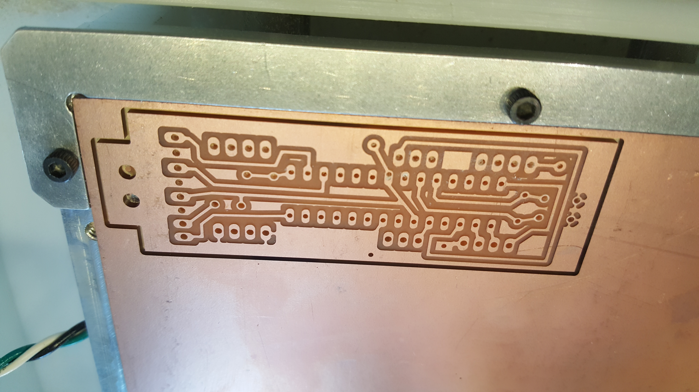
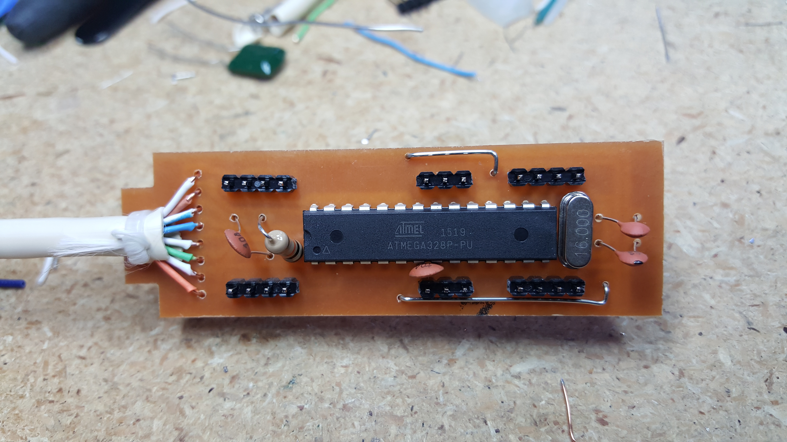
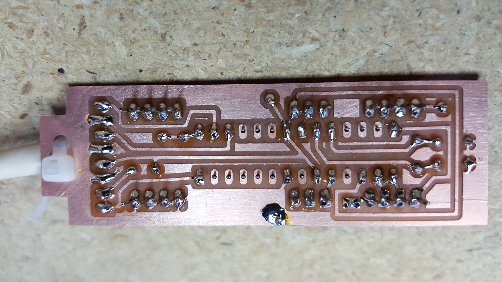
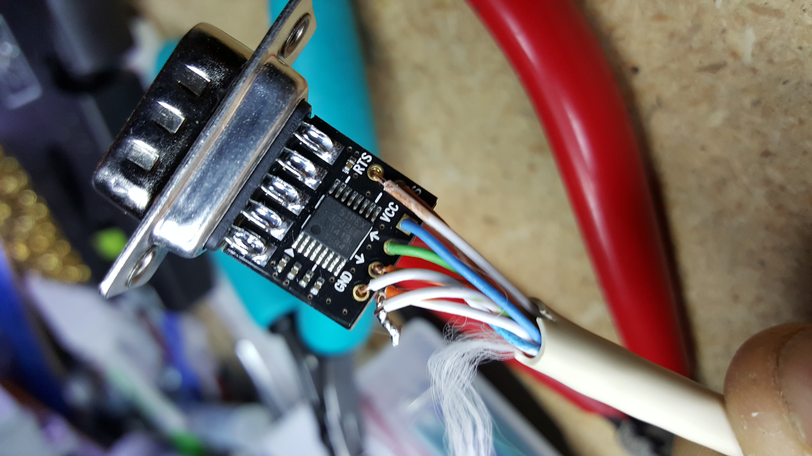
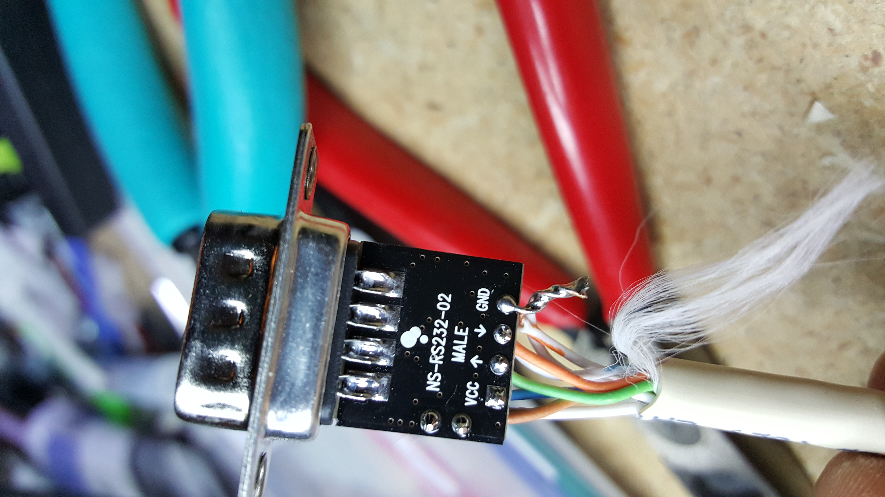
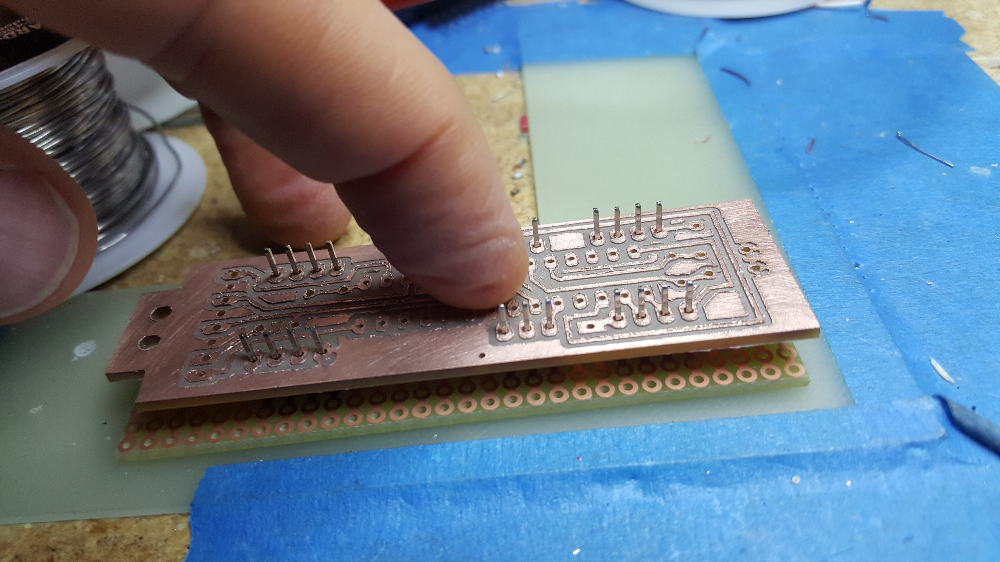

These files are for fabricating the daughter board that replaces the CPU on the LED controller cards.

Each board plugs unto the 40-pin socket on the LED controller card on one end and has a DB9 RS232 connector that connects to the master controller on the other end.

 

The board is single sided and you only use the bottom copper layer. It is designed to be cut on a milling machine with a 1/32" end mill. 

This finished boards look like this...

I used this board to do the TTL-RS232 level conversions...

https://www.amazon.com/Ultra-Compact-RS232-Converter-Female/dp/B00OPW605S/ref=as_sl_pc_ss_til?tag=joshcom-20&linkCode=w01&linkId=D7MJEJFMPVF6UVL7&creativeASIN=B00OPW605S

It is nice because it has the female DB9 connector built in and also even comes with a matching hood. You could also make a board like this yourself with a MAX232 chip or equivalent.

Here are the connections...

 

The actual wire colors are not important as long as the signals get to the right pins on the daughterboard. We are currently running the serial link at 1Mbps, so it is probably a good idea to ground the other half of the RX and TX wire pairs.    

The project with schematic is available on Upverter here...

https://upverter.com/bigjosh/d534136d65680292/BlueLED-daughter-board-14-Linear-cat5/

The gerber and excelon files are available below. 

The board is slightly odd in that the headers are pushed though the *top* of the board and then soldered on the bottom. This gives them strength for when the board is pushed into the socket. 

To push the pins though a little farther and make sure they are stright, I make a sandwich with the daughterboard and some perfboard and then push the pins down onto a hard, flat surface like this...

  

