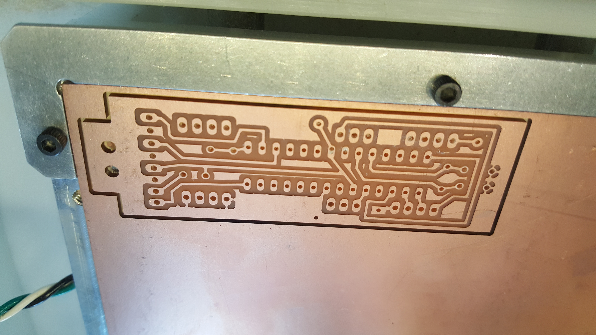
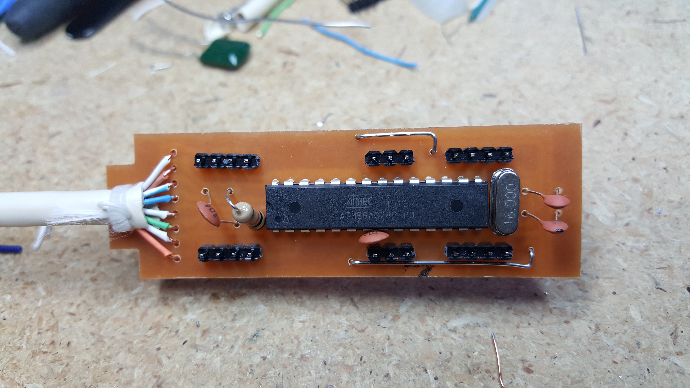
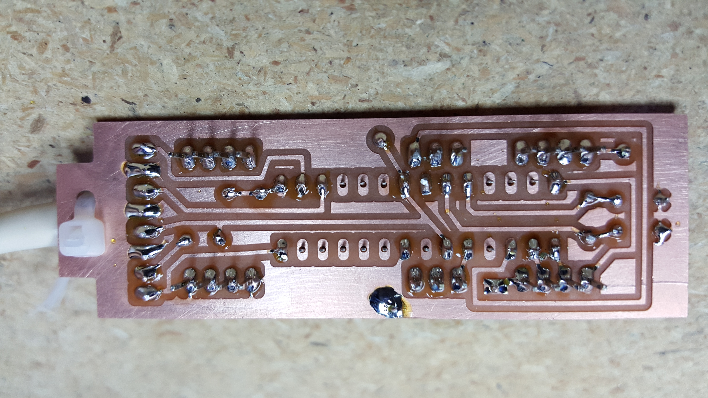
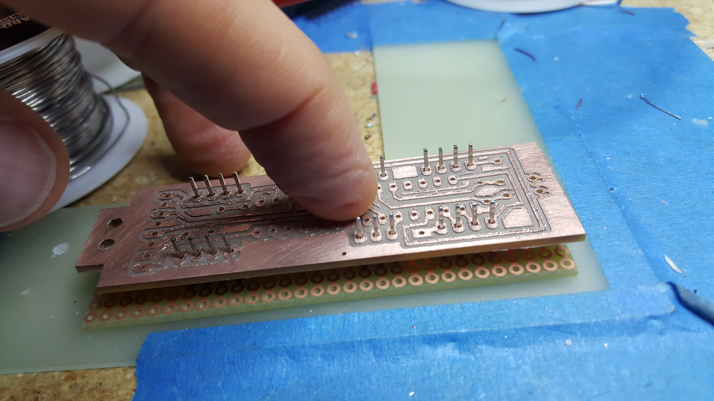
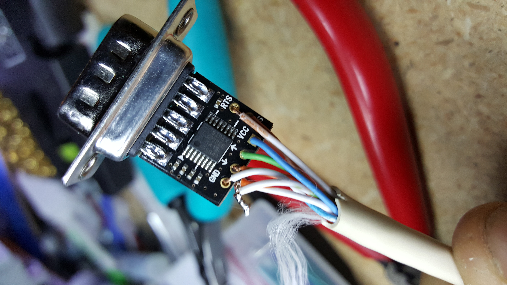
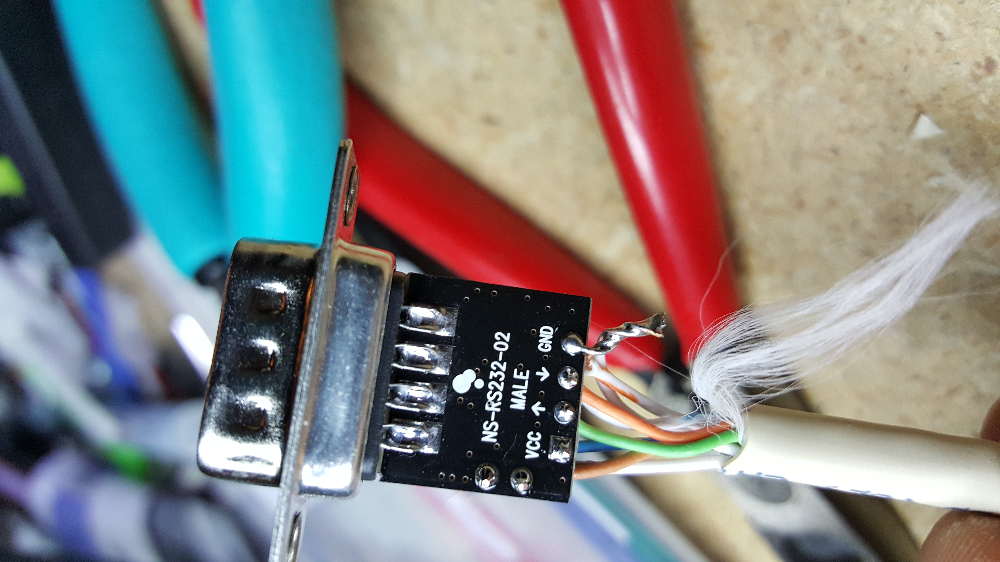

# Daughterboard hardware

## Highlights

* Single sided board with minimum 1/32" trace clearance. Easily fabbed on a milling machine. 
* Uses super cheap and widely avail bale  ATMEGA328p microcontroller for all functions. 
* Less than $2 total parts cost.
* Generates a series of tourture test patterns on startup that help to find problems durring setup.

## Fab

The board is single sided and you only use the bottom copper layer. It is designed to be cut on a milling machine with a 1/32" end mill. 

This finished boards look like this...

The gerber and excelon files are available below. 

The board is slightly odd in that the headers are pushed though the *top* of the board and then soldered on the bottom. This gives them strength for when the board is pushed into the socket. 

To push the pins though a little farther and make sure they are straight, I make a sandwich with the daughterboard and some perfboard and then push the pins down onto a hard, flat surface like this...

  

## Installation 

Each board plugs unto the 40-pin IC1 socket on the LED controller card on one end and has a DB9 RS232 connector that connects to the master controller on the other end.

The pigtail should exit opposite the marked pin #1 on IC1. 

Make sure the board "clicks" when you push it in all the way. I've had a could of times when garbled text on the display was a result of a loose socket connection on the clock or data pins. 

Be careful not to push on the crystal to hard or it might push though the pads on the back. This has happened a couple of times in the field. 

It may also be helpful to remove the other two 40 pin ICs on the controller board if they are socketed since they put a small additional load on all the signal lines. 

## RS232 level conversion

This board only talks 5 volt RS232. To connect to standard high voltage RS232 connectors, you will need to do some level conversion. 

I used this board to do the TTL-RS232 level conversions...

https://www.amazon.com/Ultra-Compact-RS232-Converter-Female/dp/B00OPW605S/ref=as_sl_pc_ss_til?tag=joshcom-20&linkCode=w01&linkId=D7MJEJFMPVF6UVL7&creativeASIN=B00OPW605S

It is nice because it has the female DB9 connector built in and also even comes with a matching hood. You could also make a board like this yourself with a MAX232 chip or equivalent.

Here are the connections...

 

The actual wire colors are not important as long as the signals get to the right pins on the daughterboard. We are currently running the serial link at 1Mbps, so it is probably a good idea to ground the other half of the RX and TX wire pairs.    

## Schematic

The project with schematic is available on Upverter here...

https://upverter.com/bigjosh/d534136d65680292/BlueLED-daughter-board-14-Linear-cat5/

